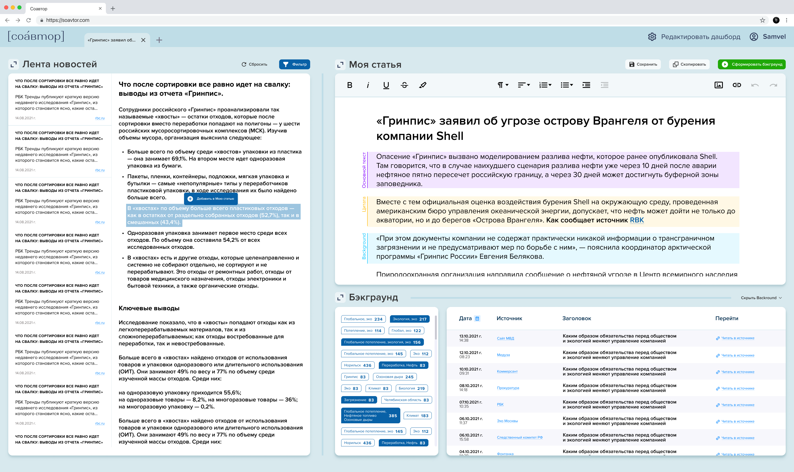

# СоАвтор
СоАвтор – платформа и открытый набор инструментов для редакций и журналистов-фрилансеров, который призван сделать процесс создания контента максимально комфортным и быстрым.  

Инструменты для СоАвтора разрабатываются на основе [открытой аналитической платформы OT](https://ot-platform.ru/). 
В ближайших планах полная интеграция приложения с платформой: сбор и обработка данных, запуск аналитических алгоритмов, а также сборка и запуск приложения будет осуществляться на платформе.
Публичный репозиторий с инструментами платформы OT coming soon.

Сейчас мы разрабатываем следующие инструменты: 
* **Отслеживание событий и трендов** в режиме реального времени (работа со структурированными новостными форматами и парсинг новостных источников). Для этого мы пишем модуль для непрерывного парсинга новостных изданий и придумываем, как отслеживать информативные изменения в статьях.
* Подбор релевантных статей к готовому материалу для автоматического формирования модуля **бэкграунда** (справочной информации или предыстории события). Для этого мы используем инструменты для поиска семантически похожих текстов в архиве и инструменты для генерации саммари из нескольких документов.

Разработка ведется вместе с профессиональным сообществом, чтобы сделать рабочий процесс для редакций и фрилансеров максимально удобным.
Платформа "СоАвтор" имеет модульную структуру. Вы можете придумать новый инструмент, который упрощает работу с текстом, или принять участие в работе над теми, что уже в разработке. 
Вступайте в наше [сообщество на Discord](https://discord.com/invite/qzYk2ErsME) и присылайте свои #идеи того, как можно использовать “СоАвтор” при работе с контентом.

***
***English below***
***

## Запустить приложение у себя

### Установка
1. Скачайте файлы проекта или сделайте форк и воспользуйтесь командой `git clone`
2. Скачайте файлы с данными: [ru_stopwords.txt](https://drive.google.com/file/d/1zoPSpUM_IOp62uypMNAPgnn4y3wgQYKW/view?usp=sharing) и [news_df.parquet](https://drive.google.com/file/d/1rc1khN5DmwF0xeY73iHWOp1UlqxtLpx_/view?usp=sharing)
3. Скачайте файлы моделей: [rubert_tiny](https://drive.google.com/drive/folders/16uQsVX6e5HtjoPH1P0lcKPl1zJLe7Bra?usp=sharing) и [rut5_base_sum](https://drive.google.com/drive/folders/1Q2UjRFwQTkHHiF8yxJtc2AO1UYtDuViG?usp=sharing)
4. Откройте терминал и перейдите в директорию проекта
5. Используйте `pip install requirements.txt`, чтобы установить все нужные библиотеки

### Запуск
1. Поменяйте в файле `config.yaml` пути к файлам данных и моделям
2. Откройте терминал и перейдите в директорию проекта
3. Наберите в терминале команду `streamlit run menu.py`
4. Приложение по умолчанию будет доступно по адресу http://localhost:8501
P.S.: приложение можно запустить на своём датасете, если будет соблюдён формат. [Пример датасета](data/data_sample.parquet) и [описание формата](data/data_description.md) в директории `data`.

## Как участвовать в разработке проекта

### Текущие задачи
1. Обновляемая лента новостей
2. Модуль для подключения к соцсетям
3. Анализ трендов по постам из социальных сетей
4. Классификация evergreen новостей

### Помочь решить одну из текущих проблем
1. Проверьте есть ли открытые проблемы в Issues и выберите одну из них
2. Если у вас есть своя идея, как законтрибьютить в этот проект, откройте в Issues новый тикет (как это сделать, описано ниже).
3. Сделайте форк проекта, начните работать над тикетом и внесите свои изменения через pull request.

### Добавить проблему (issue)
1. Если вы нашли баг или недоработку, мы будем признательны, если вы оставите её описание в разделе Issues с тегом `bug`.
2. Если у вас есть вопросы по функционалу или вы не понимаете баг это или фича, оставьте нам вопрос в разделе Issues с тегом `question`.
3. Если у вас есть идея, какие возможности вы хотели бы ещё видеть в приложении, но не уверены, что можете их самостоятельно реализовать, добавьте описание идеи в раздел Issues с тегом `enhancement`.

## Что ещё я могу делать
1. Принять участие в обсуждении этого проекта или ваших собственных идей в дискорде нашего сообщества [WellnessDataClub](https://welldata.club/).
2. Взять СоАвтор за основу для разработки собственного open source продукта. СоАвтор сейчас работает с новостями и соцсетями, вы можете начать работать с другим типом данных :)
3. Примите участие в другом нашем open source проекте [OpenMask](https://github.com/ISGNeuroTeam/OpenMask)

***

## Launch this project locally

### Installation
1. Download project files or make fork and use `git clone`
2. Download data files: [ru_stopwords.txt](https://drive.google.com/file/d/1zoPSpUM_IOp62uypMNAPgnn4y3wgQYKW/view?usp=sharing) и [news_df.parquet](https://drive.google.com/file/d/1rc1khN5DmwF0xeY73iHWOp1UlqxtLpx_/view?usp=sharing)
3. Download models: [rubert_tiny](https://drive.google.com/drive/folders/16uQsVX6e5HtjoPH1P0lcKPl1zJLe7Bra?usp=sharing) и [rut5_base_sum](https://drive.google.com/drive/folders/1Q2UjRFwQTkHHiF8yxJtc2AO1UYtDuViG?usp=sharing)
4. Using the terminal, change directory to the project's directory
5. Use `pip install requirements.txt`

### Launch
1. Change paths to the data and models inside `config.yaml`
2. Using the terminal, change directory to the project's directory
3. Run `streamlit run menu.py`
4. The app is available with http://localhost:8501 by default
P.S.: this app can be launched with your own data in the right format [Dataset example](data/data_sample.parquet), [format description](data/data_description.md) are in the `data` directory.

## How to participate in this project

### Current tasks
1. Updating news feed
2. One module to collect social network data
3. Trend analysis based on social network posts 
4. Evergreen news classification

### Help to resolve one of current issues 
1. Check if there is an open issue that you'd like to solve
2. If you have your own idea or see a bug, add a new issue (instructions below) 
3. Make fork from this project, make changes and add them with new pull request.

### Add an issue
1. Add bugs or smth that has to be finished to Issues with `bug` tag.
2. If you have questions about functionality or code ask in Issues with`question` tag.
3. If you have some ideas about new functions, suggest it in Issues with `enhancement` tag.

## What else can I do
1. Take part in the discussion of this project or your own ideas with our Discord community [WellnessDataClub](https://welldata.club/).
2. Use this project as a base for your own open source product. We now work with news, you csn choose another data type :)
3. Become a part of our another project [OpenMask](https://github.com/ISGNeuroTeam/OpenMask)